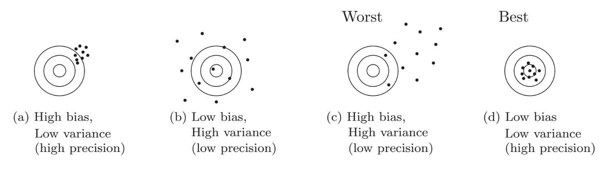

```{r setup, include = FALSE}
knitr::opts_chunk$set(
  collapse = TRUE,
  results = "asis",
  echo = TRUE,
  comment = "#>",
  out.width = "100%"
)
library(xaringanthemer)
```

```{r xaringan-themer, include=FALSE, warning=FALSE}
style_mono_accent(
  header_font_google = google_font("Josefin Slab", "600"),
  text_font_google   = google_font("Work Sans", "300", "300i"),
  code_font_google   = google_font("IBM Plex Mono")
)

style_mono_light(
  base_color = "#003366",
  link_color = "#996600",
  text_bold_color = "#996600",
  link_decoration = "underline"
)
```

```{r xaringan-panelset, echo=FALSE}
xaringanExtra::use_panelset()
```

```{r echo=FALSE}
library(ggplot2)
```

class: inverse, center, middle

# Let's start by recalling what we have learned in class!

---

## Bias–variance decomposition of squared error

When fitting a model, we want to minimize
$$\mathbb{E}_{\mathcal{D}}\left[\left(f(X)-\hat{f}(X;\mathcal{D})\right)^2\right]$$
w.r.t $\hat{f}$.

If we add and substract $\mathbb{E}_{\mathcal{D}}\left[\hat{f}(X;\mathcal{D})\right]$ inside the brackets, we have
$$
\begin{aligned}
    &\mathbb{E}_{\mathcal{D}}\left[\left(f(X)-\hat{f}(X;\mathcal{D})\right)^2\right] \\
    = &\underbrace{\left(f(X) - \mathbb{E}_{\mathcal{D}}\left[\hat{f}(X;\mathcal{D})\right]\right)^2}_{Bias^2} + \underbrace{\mathbb{E}_{\mathcal{D}}\left[\left(\mathbb{E}_{\mathcal{D}}\left[\hat{f}(X;\mathcal{D})\right] - \hat{f}(X;\mathcal{D})\right)^2\right]}_{Variance}
\end{aligned}
$$

---

## Two sources of error

- **Bias** from erroneous assumptions in the learning algorithm.

  High bias $\longrightarrow$ **underfitting**.
  
- **Variance** from sensitivity to small fluctuations in the training set.

  High variance $\longrightarrow$ **overfitting**.

```{r out.width='95%', fig.align='center', echo=FALSE}

```

---
class: inverse, center, middle

# A toy example

---

## Problem setting

.panelset[

.panel[.panel-name[Setting]

- Suppose we know the ground truth of $f(\cdot):f(x)=\sin(2\pi x)$

- Now given $\{x_n\}_{n=1}^N$, we have a set of observations $\mathcal{D}=\{(x_n,y_n)\}_{n=1}^N$ with $$y_n=f(x_n) + \epsilon_n,$$ where $\epsilon_n \stackrel{\text { i.i.d. }}{\sim} \mathcal{N}(0,1)$ is random noise.

```{r panelset = c(source = "Code", output = "Plot"),fig.align='center',out.width="50%"}
set.seed(123)

# Ground truth
x <- seq(0, 1, length.out = 100)
y <- sin(2 * pi * x)
# Observed data
N <- 50 # Sample size
X <- runif(N, 0, 1)
y0 <- sin(2 * pi * X)
y_obs <- y0 + rnorm(N, mean = 0, sd = 1) # Add noise

ggplot(data = NULL) +
  geom_line(aes(x = x, y = y), color = "red", size = 2) +
  geom_point(aes(x = X, y = y_obs), size = 5) +
  theme(
    text = element_text(size = 18),
    axis.text.y = element_text(size = 18),
    axis.text.x = element_text(size = 18)
    )
```

]

.panel[.panel-name[Fit the model]

For a given $\mathcal{D}$, we can fit a model $\hat{f}(X;\mathcal{D})$, e.g., linear regression.

```{r panelset = c(source = "Code", output = "Plot"),fig.align='center',out.width="50%"}
set.seed(123)

ggplot(data = NULL) +
  geom_line(aes(x = x, y = y), color = "red", size = 2) +
  geom_point(aes(x = X, y = y_obs), size = 5) +
  geom_smooth(aes(x = X, y = y_obs), method = "lm") + # Linear regression
  theme(legend.position = "none") +
  theme(
    text = element_text(size = 18),
    axis.text.y = element_text(size = 18),
    axis.text.x = element_text(size = 18)
    )
```

]

]

---

## Smoothing spline <sup>*</sup>

Assume $f(\cdot)$ is some unknown **smooth** function, to estimate $f(\cdot)$, a smoothing spline minimizes the penalized least squares functional
$$f_{\lambda} = \min_{f \in \mathcal{H}} \frac{1}{n} \sum_{i=1}^n \left(y_i-f\left(x_i\right)\right)^2 + \lambda J_m(f),$$
where $J_m(f)=\int\left|f^{(m)}(z)\right|^2 d z$ is a penalty term that quantifies the lack of parsimony of the function estimate, and $\lambda>0$ is the smoothing parameter that controls the influence of the penalty.

Note that $f^{(m)}(\cdot)$ denotes the $m$-th derivative of $f(\cdot)$, and $\mathcal{H}=\left\{f: J_m(f)<\infty\right\}$ is the space of functions with square integrable $m$-th derivative.

.footnote[
[*] See [Wikipedia](https://en.wikipedia.org/wiki/Smoothing_spline#:~:text=Smoothing%20splines%20are%20function%20estimates,means%20for%20smoothing%20noisy%20data.) or [Smoothing Spline Regression in R](http://users.stat.umn.edu/~helwig/notes/smooth-spline-notes.html) for more details if you are interested. However, this is not the point of this course!
]

---

## Smoothing parameter

.panelset[

.panel[.panel-name[Smoothing parameter influence]

- As $\lambda \rightarrow 0$ the penalty has less influence on the penalized least squares functional. So, for very small values of $\lambda$, the function estimate $f_\lambda$ essentially minimizes the residual sum of squares.

- As $\lambda \rightarrow \infty$ the penalty has more influence on the penalized least squares functional. So, for very large values of $\lambda$, the function estimate $f_\lambda$ is essentially constrained to have a zero penalty, i.e., $J_m\left(f_\lambda\right) \approx 0$.

- As $\lambda$ increases from 0 to $\infty$, the function estimate $f_\lambda$ is forced to be smoother with respect to the penalty functional $J_m(\cdot)$. The goal is to find the $\lambda$ that produces the "correct" degree of smoothness for the function estimate.

```{r panelset = c(source = "Code", output = "Plot"),fig.align='center',out.width="50%",message=FALSE}
library(ggformula)

ggplot(data = NULL, aes(x = X, y = y_obs)) +
  geom_point(size = 5) +
  geom_spline(aes(x = X, y = y_obs), spar = 1e-2, colour = "red", size = 2) + # Small lambda
  geom_spline(aes(x = X, y = y_obs), cv = TRUE, colour = "blue", size = 2) + # Cross-validation
  geom_spline(aes(x = X, y = y_obs), spar = 2, colour = "green", size = 2) + # Large lambda
  xlab("x") +
  ylab("y") +
  ggtitle("Smoothing spline regression") +
  theme(
    text = element_text(size = 18),
    axis.text.y = element_text(size = 18),
    axis.text.x = element_text(size = 18)
    )
```

]

]

---

## How do we evaluate the bias-variance trade-off in this example?

We need $\mathbb{E}_{\mathcal{D}}(\hat{f}(X;\mathcal{D}))$, therefore, we need to have multiple datasets.

- For $l=1,...,L$,
    - generate $\mathcal{D}^l=\{(x_n,y^l_n)\}_{n=1}^N$, where $y^l_n=f(x_n) + \epsilon^l_n$
    - fit the $l$-th model $\hat{f}(X^l;\mathcal{D}^l)$ and denote the predicted value as $y^l(x_n)=\hat{f}(x_n;\mathcal{D}^l)$
    
  **Note that $f(x_n)$ is fixed across $l$ while the observed values $y^l_n$ are varying due to random noise $\epsilon_n^l$.**

- Estimate $\mathbb{E}_{\mathcal{D}}[\hat{f}(X;\mathcal{D})]$ by $\bar{y}(x)=\frac{1}{L}\sum_{l=1}^Ly^l(x)$

- Compute squared bias: $\frac{1}{N}\sum_{n=1}^N \left( \bar{y}(x_n)-f(x_n) \right)^2$

- Compute variance: $\frac{1}{N}\sum_{n=1}^N\frac{1}{L}\sum_{l=1}^L \left( y^l(x_n)-\bar{y}(x_n) \right)^2$

---

## Experiments

.panelset[

.panel[.panel-name[Experiments setting]

We take the above example with $N = 20$, $L = 500$ and use smoothing spline regression with $\lambda \in [1 \times 10^{-6}, 10]$.

```{r}
set.seed(123)

trial <- 500 # Number of experiment trials
N <- 20 # Number of samples for each trial
lambda_list <- exp(seq(log(1e-6), log(10), length.out = 100)) # Parameter list
model_list <- list() # Model list
biasSQ <- variance <- vector(mode = "numeric", length = length(lambda_list)) # Bias and variance

X <- runif(N, 0, 1) # Predictor
y0 <- sin(2 * pi * X) # True values of y
y_mat = matrix(0, nrow = N, ncol = trial) # Store the generated response variables
for(j in 1 : trial){
  y_mat[, j] = y0 + rnorm(N, mean = 0, sd = 1) # Add noise; each column contains a dataset 
}
```

]

.panel[.panel-name[Implementation]

```{r}
for(i in 1 : length(lambda_list)){
  model_list_i <- list()
  y_hat <- matrix(0, nrow = N, ncol = trial) # Predicted values
  
  for(j in 1 : trial){
    y <- y_mat[, j]
    fit_ss <- smooth.spline(x = X, y = y, lambda = lambda_list[i]) # Smoothing spline regression
    model_list_i <- c(model_list_i, list(fit_ss)) # Save the model for the current training dataset
    y_hat[, j] <- predict(fit_ss, X)$y # Predicted values
  }
  
  model_list <- c(model_list, list(model_list_i)) # Save the model list for the current parameter
  y_bar <- rowMeans(y_hat) # Mean of predicted values, E(f^hat)
  biasSQ[i] <- mean((y0 - y_bar)^2)  # Bias square, E[ (f - E(f^hat))^2 ]
  variance[i] <- mean((y_hat - y_bar)^2)   # Variance, E[ (E(f^hat) - f^hat)^2 ]
  }
```

]

]

---

## Visualization

.panelset[

.panel[.panel-name[Bias and variance]

Let's first take a look at how the two sources of error change as the parameter $\lambda$ changes.

```{r panelset = c(source = "Code", output = "Plot"),fig.align='center',out.width="50%",message=FALSE}
ggplot(data = NULL) +
  geom_line(aes(x = log(lambda_list), y = biasSQ, color = "biasSQ"), size = 2) +
  geom_line(aes(x = log(lambda_list), y = variance, color = "variance"), size = 2) +
  geom_line(aes(x = log(lambda_list), y = biasSQ + variance, color = "biasSQ + variance"), size = 2) +
  geom_vline(xintercept = log(lambda_list)[which.min(biasSQ + variance)], linetype = "longdash", size = 2) + # Minimal error
  xlab("log(lambda)") +
  ylab("Error") +
  scale_color_manual(name = "Sources of error",
                     breaks = c("biasSQ", "variance", "biasSQ + variance"),
                     values = c("biasSQ" = "red", "variance" = "blue", "biasSQ + variance" = "green")) +
  theme(
    text = element_text(size = 18),
    axis.text.y = element_text(size = 18),
    axis.text.x = element_text(size = 18),
    legend.title = element_text(size = 15),
    legend.text = element_text(size = 15),
    legend.position = "bottom"
    )
```

]

]

---

## More details

.panelset[

.panel[.panel-name[More details]

Then we chose three different values for the parameter $\lambda$ (too small, suitable, too large) and visualize for more performance details.

```{r panelset = c(source = "Code", output = "Plot"),fig.align='center',out.width="50%",message=FALSE}
par(mfrow = c(3, 2))

N <- 100
lambda_idx_list <- c(1, which.min(biasSQ + variance), 100)
x <- seq(0, 1, length.out = N)
y0 <- sin(2 * pi * x)

for(lambda_idx in lambda_idx_list){
  plot(x, y0, col = "green", type = "l", ylim = c(-3, 3), ylab = "y", cex = 2, cex.axis = 2, cex.lab = 2)
  
  y_hat <- matrix(0, nrow = N, ncol = 20)
  for(j in 1 : 20){
    y_hat[, j] <- predict(model_list[[lambda_idx]][[j]], x)$y
    lines(x, y_hat[, j], col = "red", ylim = c(-3, 3))
    }
  
  plot(x, y0, col = "green", type = "l", ylim = c(-3, 3), ylab = "y", cex = 2, cex.axis = 2, cex.lab = 2)
  lines(x, rowMeans(y_hat), col = "red", ylim = c(-3, 3))
  }
```
]

]

---
class: inverse, center, middle

# Thank you!

Slides created via Yihui Xie's R package [**xaringan**](https://github.com/yihui/xaringan).

Theme customized via Garrick Aden-Buie's R package [**xaringanthemer**](https://github.com/gadenbuie/xaringanthemer).

Tabbed panels created via Garrick Aden-Buie's R package [**xaringanExtra**](https://github.com/gadenbuie/xaringanExtra/).

The chakra comes from [remark.js](https://remarkjs.com), [**knitr**](https://yihui.org/knitr/), and [R Markdown](https://rmarkdown.rstudio.com).