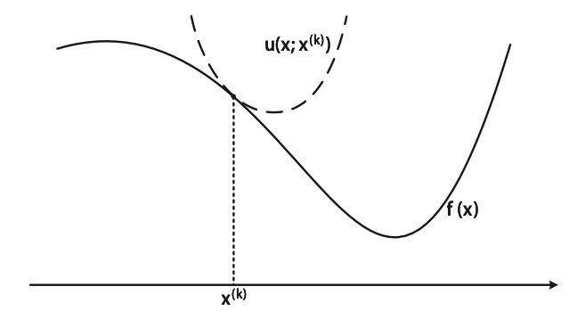
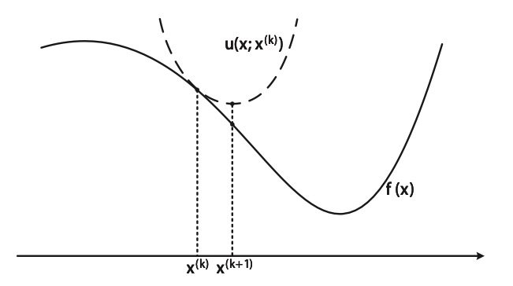
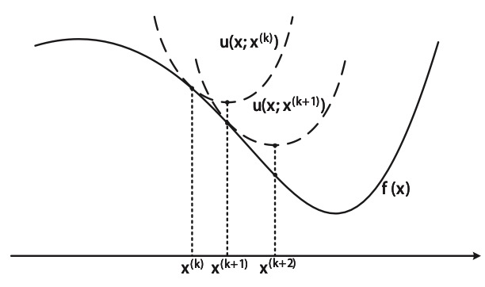

```{r setup, include = FALSE}
knitr::opts_chunk$set(
  collapse = TRUE,
  results = "asis",
  echo = TRUE,
  comment = "#>",
  out.width = "100%"
)
library(xaringanthemer)
```

```{r xaringan-themer, include=FALSE, warning=FALSE}
style_mono_accent(
  header_font_google = google_font("Josefin Slab", "600"),
  text_font_google   = google_font("Work Sans", "300", "300i"),
  code_font_google   = google_font("IBM Plex Mono")
)

style_mono_light(
  base_color = "#003366",
  link_color = "#996600",
  text_bold_color = "#996600",
  link_decoration = "underline"
)
```

```{r xaringan-panelset, echo=FALSE}
xaringanExtra::use_panelset()
```

```{r echo=FALSE, message=FALSE}
library(ggplot2)
```

class: inverse, center, middle

# Let's start by recalling linear regression!

---

## Least squares

Recall the least squares (LS) problem for linear regression
$$\hat{\beta} = \underset{\mathbf{\beta}}{\operatorname{argmin}} \sum_{i = 1}^{N} (y_i - x_i^T \beta)^2 = \underset{\mathbf{\beta}}{\operatorname{argmin}} \frac{1}{N}\sum_{i = 1}^{N} (y_i - x_i^T \beta)^2.$$
.panelset[

.panel[.panel-name[A toy example]

- Suppose we know the ground truth of $f(\cdot):f(x)=x$

- Now given $\{x_i\}_{i=1}^N$, we have a set of observations $\mathcal{D}=\{(x_i,y_i)\}_{i=1}^N$ with $$y_i=f(x_i) + \epsilon_i,$$ where $\epsilon_i \stackrel{\text { i.i.d. }}{\sim} \mathcal{N}(0,0.1^2)$ is random noise.

```{r panelset = c(source = "Code", output = "Minimize the squared loss"),fig.align='center',out.width="40%",message=FALSE}
set.seed(123)
N <- 10 # Sample size
x <- runif(N, 0, 1)
y0 <- x # Ground truth
y_obs <- y0 + rnorm(N, mean = 0, sd = 0.1) # Add noise, observed data
ggplot(data = NULL, aes(x = x, y = y_obs)) +
  geom_point(aes(x = x, y = y_obs), size = 5) +
  geom_smooth(method = "lm", size = 2) +
  ylab("y") +
  theme(
    text = element_text(size = 20),
    axis.text.y = element_text(size = 20),
    axis.text.x = element_text(size = 20)
    )
```

]

]

---
class: inverse, center, middle

# What if there exists an outlier?

---

## Add an outlier

.panelset[

.panel[.panel-name[Add an outlier]

- We follow the above problem setting.

- But add an outlier 
$$(x, y, y_{\text{obs}}) = (0.9, 0.9, -2),$$
of which the noise is extremely large.
This situation is rare, but the probability is not zero!

```{r panelset = c(source = "Code", output = "Minimize the squared loss"),fig.align='center',out.width="50%",message=FALSE}
x_ol <- c(x, 0.9)
y0_ol <- c(y0, 0.9)
y_obs_ol <- c(y_obs, -2)

ggplot(data = NULL) +
  geom_point(aes(x = x, y = y_obs), size = 5) +
  geom_point(aes(x = 0.9, y = -2), color = "red", size = 5) +
  geom_smooth(aes(x = x, y = y_obs), method = "lm", color = "blue", size = 2) +
  geom_smooth(aes(x = x_ol, y = y_obs_ol), method = "lm", color = "red", size = 2) +
  ylab("y") +
  theme(
    text = element_text(size = 20),
    axis.text.y = element_text(size = 20),
    axis.text.x = element_text(size = 20)
    )
```

]

]

---

## Brief summary of squared loss

Pros

- Natural, intuitive (Euclidean distance)

- Closed form solution

Con

- Not robust to outliers, equal weights to all data (assumes Gaussian distributed residual)

---
class: inverse, center, middle

# Let's consider a more robust loss function!

---

## $l_1$ loss

- $l_2$ norm and $l_1$ norm
$$||x||_2 = \left( \sum_{j = 1}^{p} x_j^2\right)^{\frac{1}{2}}, \quad ||x||_1 = \sum_{j = 1}^{p} |x_j|.$$

- $l_2$ loss and $l_1$ loss
$$\mathcal{L}_2 = \sum_{i = 1}^{N} (y_i - x_i^T \beta)^2 = ||y - X \beta||_2^2, \\
\mathcal{L}_1 = \sum_{i = 1}^{N} |y_i - x_i^T \beta| = ||y - X \beta||_1.$$

---

## Why is $l_1$ more robust?

```{r out.width='55%', fig.align='center', echo=FALSE}
r <- runif(500, -3, 3)
l1 <- abs(r)
l2 <- r^2

ggplot(data = NULL) +
  geom_line(aes(x = r, y = l2, color = "l2"), size = 2) +
  geom_line(aes(x = r, y = l1, color = "l1"), size = 2) +
  scale_color_manual(name = "Two loss function",
                     breaks = c("l2", "l1"),
                     values = c("l2" = "blue", "l1" = "red")) +
  xlab("Residual") +
  ylab("Loss") +
  theme(
    text = element_text(size = 20),
    axis.text.y = element_text(size = 20),
    axis.text.x = element_text(size = 20),
    legend.position = "bottom"
    )
```

--

However, the bad news is that $l_1$ loss function is not differentiable :(

---
class: inverse, center, middle

# Let's relax it!

---

## MM algorithm <sup>*</sup>

The "MM" stands for “Majorization-Minimization” or “Minorization-Maximization”.
In the following, "MM" refers to "Majorization-Minimization".

- Consider the following presumably difficult optimization problem
$$\underset{\mathbf{x}}{\operatorname{minimize}} f(\mathbf{x}) \\
\text{ subject to } \mathbf{x} \in \mathcal{X},$$
with $\mathcal{X}$ being the feasible set and $f(\mathbf{x})$ being continuous.
- Idea: successively minimize a more managable surrogate function $u\left(\mathbf{x}, \mathbf{x}^k\right)$
$$
\mathbf{x}^{k+1}=\arg \min _{\mathbf{x} \in \mathcal{X}} u\left(\mathbf{x}, \mathbf{x}^k\right),
$$
hoping the sequence of minimizers $\left\{\mathbf{x}^k\right\}$ will converge to optimal $\mathbf{x}^{\star}$.

.footnote[
[*] Not required in this course. Materials are form ELEC 5470 / IEDA 6100A Convex Optimization, Prof. Daniel P. Palomar, ECE, HKUST.
]

---

## Iterative algorithm

Suppose $x_0$ is the initial point, in $k$-th step, we want $x_{k-1} \rightarrow x_{k}$.

.panelset[

.panel[.panel-name[After k-th step]

```{r out.width='80%', fig.align='center', echo=FALSE}

```

]

.panel[.panel-name[(k+1)-th step]

```{r out.width='80%', fig.align='center', echo=FALSE}

```

]

.panel[.panel-name[(k+2)-th step]

```{r out.width='80%', fig.align='center', echo=FALSE}

```

]

]

---

## Construction rule of the surrogate / majorizer function <sup>*</sup>

$$u(\mathbf{y}, \mathbf{y})=f(\mathbf{y}), \forall \mathbf{y} \in \mathcal{X} \\
u(\mathbf{x}, \mathbf{y}) \geq f(\mathbf{x}), \forall \mathbf{x}, \mathbf{y} \in \mathcal{X} \\
\left.u^{\prime}(\mathbf{x}, \mathbf{y} ; \mathbf{d})\right|_{\mathbf{x}=\mathbf{y}}=f^{\prime}(\mathbf{y} ; \mathbf{d}), \forall \mathbf{d} \text { with } \mathbf{y}+\mathbf{d} \in \mathcal{X} \\
u(\mathbf{x}, \mathbf{y}) \text { is continuous in } \mathbf{x} \text { and } \mathbf{y}$$

```{r out.width='60%', fig.align='center', echo=FALSE}

```

---
class: inverse, center, middle

### Question: how to construct $u\left(\mathbf{x}, \mathbf{x}^k\right)$ ?

--

### Answer: that's more like an art :)

--

### Luckily, the MM algorithm for $l_1$-norm minimization has been well established!

---

## Majorizer for $l_1$-norm

- Consider the following quadratic majorizer of $f(t)=|t|$ for $t \neq 0$ (for simplicity we ignore this case)
$$
u\left(t, t^k\right)=\frac{1}{2\left|t^k\right|}\left(t^2+\left(t^k\right)^2\right) .
$$

- It is a valid majorizer since it is continuous, and
$$u\left(t, t^k\right) \geq f(t),$$
$$u\left(t^k, t^k\right)=f(t),$$ 
$$\frac{d}{d t} u\left(t^k, t^k\right)=\frac{d}{d t} f\left(t^k\right).$$

---

## Majorizer for $l_1$-norm

```{r echo=FALSE,fig.align='center',out.width="60%"}
t <- seq(-5, 5, length = 500)
l1 <- abs(t)

t_k_1 <- -3.5
l1_maj_1 <- (t^2 + t_k_1^2) / 2 / abs(t_k_1)

t_k_2 <- -1
l1_maj_2 <- (t^2 + t_k_2^2) / 2 / abs(t_k_2)

ggplot(data = NULL) +
  geom_line(aes(x = t, y = l1, color = "l1 norm"), size = 1.5) +
  geom_line(aes(x = t, y = l1_maj_1, color = "Majorizer_1"), size = 1.5) +
  geom_line(aes(x = t, y = l1_maj_2, color = "Majorizer_2"), size = 1.5) +
  geom_vline(xintercept = t_k_1, linetype = "dashed", size = 1.5) +
  geom_vline(xintercept = t_k_2, linetype = "dashed", size = 1.5) +
  scale_color_manual(name = NULL,
                     breaks = c("l1 norm", "Majorizer_1", "Majorizer_2"),
                     values = c("l1 norm" = "red", "Majorizer_1" = "blue", "Majorizer_2" = "green")) +
  xlab(NULL) +
  ylab(NULL) +
  theme(
    text = element_text(size = 20),
    axis.text.y = element_text(size = 20),
    axis.text.x = element_text(size = 20),
    legend.position = "bottom"
    )
```

---

## Reweighted LS for $l_1$-norm minimization

- Now we can apply it to the $\ell_1$-norm: a quadratic majorizer of $f(\beta) = \|X \beta - y\|_1$ is
$$
u \left(\beta, \beta^k\right) = \sum_{i=1}^N \frac{1}{2 \left| \left[ X \beta^ { k } - y \right]_i \right| } \left( [X \beta - y]_i^2 + \left( \left[ X \beta^ { k } - y \right]_i \right)^2 \right).
$$

--

- Now that we have the majorizer, we can write the MM iterative algorithm for $k=0,1, \ldots$ as
$$
\underset{\beta}{\operatorname{minimize}} ||(X \beta - y) \odot w^k ||_2^2,
$$
where $w_i^k = \sqrt{\frac{1}{2\left|\left[ X \beta^ { k } - y \right]_i \right|}}$.

---

## Algorithm

- Set $k = 0$ and initialize with a feasible point $\beta^0$

- **repeat**
  
  - $w_i^k \leftarrow \sqrt{\frac{1}{2\left|\left[ X \beta^ { k } - y \right]_i \right|}}$
  
  - Update $\beta^{k+1} \leftarrow \underset{\beta}{\operatorname{argmin}} \left\|(X \beta - y) \odot w^k \right\|_2^2$
  
  - $k \leftarrow k + 1$
  
- **until** convergence

- **return** $\beta^k$

---

## Implementation (first 4 steps)

.panelset[

.panel[.panel-name[Initialization]
```{r}
df <- data.frame(y = y_obs_ol, x = x_ol, weight = rep(0, length(x_ol))) # Data

#beta_0 <- rnorm(1) # Initialize intercept
#beta_1 <- rnorm(1) # Initialize slope
beta_0 <- -3 # To demonstrate, we fit beta_0 = -3
beta_1 <- 1 # To demonstrate, we fit beta_1 = 1
```

]

.panel[.panel-name[lm()]
```{r eval = FALSE}
opar <- par()
par(mfrow = c(2, 2))

for (k in 0:3) { # Here we only repeat 4 times
  fit_l1 <- lm(y ~ x, data = df, weights = sqrt(1 / 2 / abs(beta_0 + x * beta_1 - y))) # Reweighted LS for l1 norm minimization
  
  beta_0 <- coef(fit_l1)[1] # Update intercept
  beta_1 <- coef(fit_l1)[2] # Update slope
  
  # Visualize
  plot(x_ol, y_obs_ol, pch = 16, 
       xlab = "x", ylab = "y", 
       cex = 1.5, cex.axis = 1.5, cex.lab = 1.5)
  abline(fit_l1, col = "blue", lwd = 3, 
         cex = 1.5, cex.axis = 1.5, cex.lab = 1.5)
}
```

]

.panel[.panel-name[geom_smooth()]
```{r}
p_list <- list() # Figure list
for (k in c(1:4)) { # Here we only repeat 4 times
  df$weight <- sqrt(1 / 2 / abs(beta_0 + x_ol * beta_1 - y_obs_ol))
  fit_l1 <- lm(y ~ x, data = df, weights = weight) # Reweighted LS for l1 norm minimization
  beta_0 <- coef(fit_l1)[1] # Update intercept
  beta_1 <- coef(fit_l1)[2] # Update slope
  p <- ggplot(df, aes(x = x, y = y, size = weight / 3)) +
    geom_point(shape = 16) +
    geom_smooth(method = "lm", aes(weight = weight), size = 1.5, show.legend = FALSE) +
    theme(
      text = element_text(size = 18),
      legend.title = element_text(size = 12),
      legend.text = element_text(size = 11),
      legend.position = "bottom"
    )
  p_list <- c(p_list, list(p))
}
```

]

.panel[.panel-name[ggplot]
```{r echo=FALSE,message=FALSE,fig.align='center',out.width="55%"}
gridExtra::grid.arrange(grobs = p_list, ncol = 2)
```

]

]

---

## Full implementation

.panelset[

.panel[.panel-name[Initialization and parameter setting]
```{r}
df <- data.frame(y = y_obs_ol, x = x_ol, weight = rep(0, length(x_ol))) # Data

#beta_0 <- rnorm(1) # Initialize intercept
#beta_1 <- rnorm(1) # Initialize slope
beta_0 <- -3 # To demonstrate, we fit beta_0 = -3
beta_1 <- 1 # To demonstrate, we fit beta_1 = 1

tol <- 1e-6 # Convergence tolerance / criterion
iter_max <- 5000 # Maximum number of iterations
```

]

.panel[.panel-name[l1 norm minimization]
```{r}
l1_loss <- sum(abs(beta_0 + x_ol * beta_1 - y_obs_ol)) # l1 loss at initial point
for (k in 1:iter_max) {
  df$weight <- sqrt(1 / 2 / abs(beta_0 + x_ol * beta_1 - y_obs_ol))
  fit_l1 <- lm(y ~ x, data = df, weights = weight) # Reweighted LS for l1 norm minimization
  beta_0 <- coef(fit_l1)[1] # Update intercept
  beta_1 <- coef(fit_l1)[2] # Update slope
  
  l1_loss_current <- sum(abs(beta_0 + x_ol * beta_1 - y_obs_ol)) # l1 loss in the current step
  l1_loss <- c(l1_loss, l1_loss_current)
  
  # Whether converges
  if(abs((l1_loss[k + 1] - l1_loss[k]) / l1_loss[k]) < tol){
    break
  }
}
```

]

.panel[.panel-name[Visualization]
```{r echo=FALSE,message=FALSE,fig.align='center',out.width="55%"}
ggplot(data = NULL, aes(x = 0:(length(l1_loss) - 1), y = l1_loss)) +
  geom_point(size = 5) +
  geom_line(size = 1.5) +
  xlab("Step") +
  ylab("l1 loss") +
  theme(
    text = element_text(size = 20),
    axis.text.y = element_text(size = 20),
    axis.text.x = element_text(size = 20)
    )
```

]

]

---

## Subgradient method <sup>*</sup>

We say a vector $g \in \mathbf{R}^n$ is a subgradient of $f: \mathbf{R}^n \rightarrow \mathbf{R}$ at $x \in \operatorname{dom} f$ if for all $z \in \operatorname{dom} f$,
$$
f(z) \geq f(x)+g^T(z-x).
$$

The subgradient of $l_1$-norm can be taken as
$$g_i= 
\begin{equation}
\begin{cases}+1 & x_i>0 \\ 
-1 & x_i<0 \\ 
0 & x_i=0\end{cases}
\end{equation}.$$

--

**Note**: subgradient method is **not** a descent method, and negative subgradient is **not** always a descent direction!

.footnote[
[*] Materials are from [Subgradients](https://see.stanford.edu/materials/lsocoee364b/01-subgradients_notes.pdf) and [Subgradient Methods](https://web.stanford.edu/class/ee392o/subgrad_method.pdf), EE364b, Stephen Boyd and Lieven Vandenberghe, Stanford University.
]

---

## Implementation

.panelset[

.panel[.panel-name[Initialization and parameter setting]
```{r}
#beta_0 <- rnorm(1) # Initialize intercept
#beta_1 <- rnorm(1) # Initialize slope
beta_0 <- -3 # To demonstrate, we fit beta_0 = -3
beta_1 <- 1 # To demonstrate, we fit beta_1 = 1
beta <- c(beta_0 = beta_0, beta_1 = beta_1)

X <- cbind(x0 = rep(1, length(x_ol)), x1 = x_ol)
l1_loss <- sum(abs(beta[1] + x_ol * beta[2] - y_obs_ol)) # l1 loss at initial point

step_size <- 0.05 # Try different step size, e.g., 0.1 and 0.01, and see what will happen!
tol <- 1e-3 # Convergence tolerance / criterion
iter_max <- 5000 # Maximum number of iterations
```
]

.panel[.panel-name[Implementation]
```{r}
for (k in 1:iter_max) {
  r <- as.vector(y_obs_ol - X %*% as.matrix(c(beta))) # Residual
  subgrad <- colSums(X * sign(r)) # Subgradient
  
  beta <- beta + step_size * subgrad # Update beta

  l1_loss_current <- sum(abs(beta[1] + x_ol * beta[2] - y_obs_ol)) # l1 loss in the current step
  l1_loss <- c(l1_loss, l1_loss_current)
  
  # Whether converges
  if(abs((l1_loss[k + 1] - l1_loss[k]) / l1_loss[k]) < tol){
    break
  }
}
```

]

.panel[.panel-name[Visualization]
```{r echo=FALSE,message=FALSE,fig.align='center',out.width="55%"}
ggplot(data = NULL, aes(x = 0:(length(l1_loss) - 1), y = l1_loss)) +
  geom_point(size = 5) +
  geom_line(size = 1.5) +
  xlab("Step") +
  ylab("l1 loss") +
  theme(
    text = element_text(size = 20),
    axis.text.y = element_text(size = 20),
    axis.text.x = element_text(size = 20)
    )
```

]

]

---
class: inverse, center, middle

# Good night!

Slides created via Yihui Xie's R package [**xaringan**](https://github.com/yihui/xaringan).

Theme customized via Garrick Aden-Buie's R package [**xaringanthemer**](https://github.com/gadenbuie/xaringanthemer).

Tabbed panels created via Garrick Aden-Buie's R package [**xaringanExtra**](https://github.com/gadenbuie/xaringanExtra/).

The chakra comes from [remark.js](https://remarkjs.com), [**knitr**](https://yihui.org/knitr/), and [R Markdown](https://rmarkdown.rstudio.com).